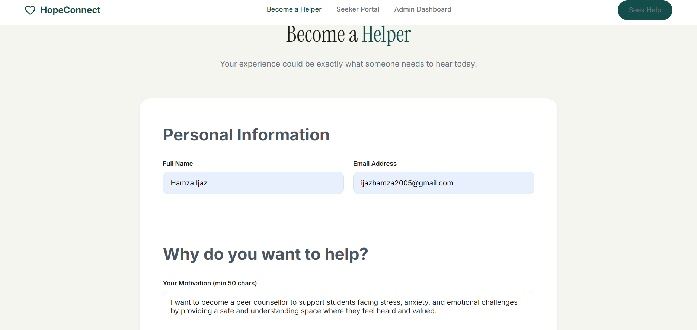
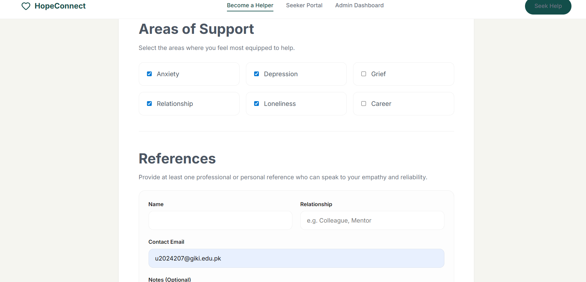
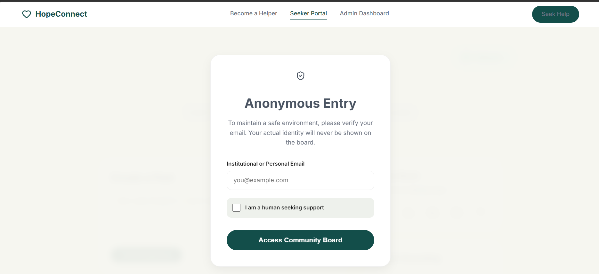
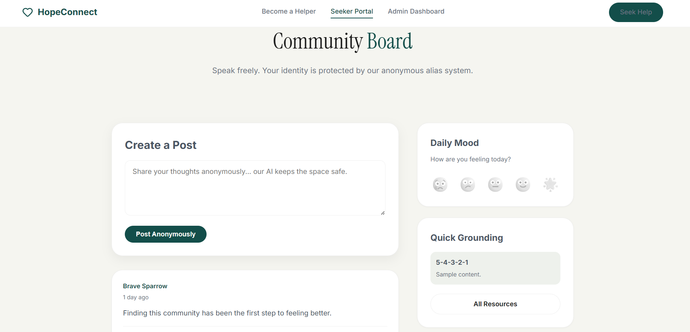
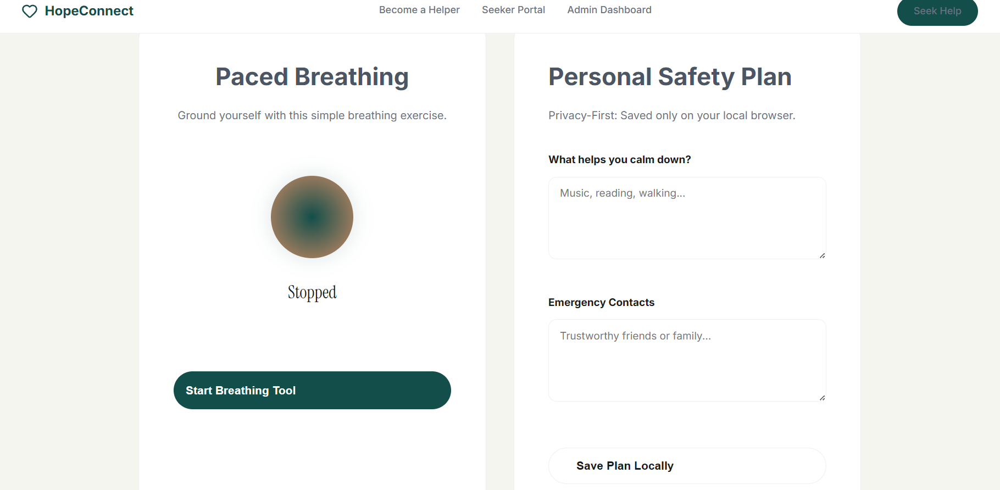
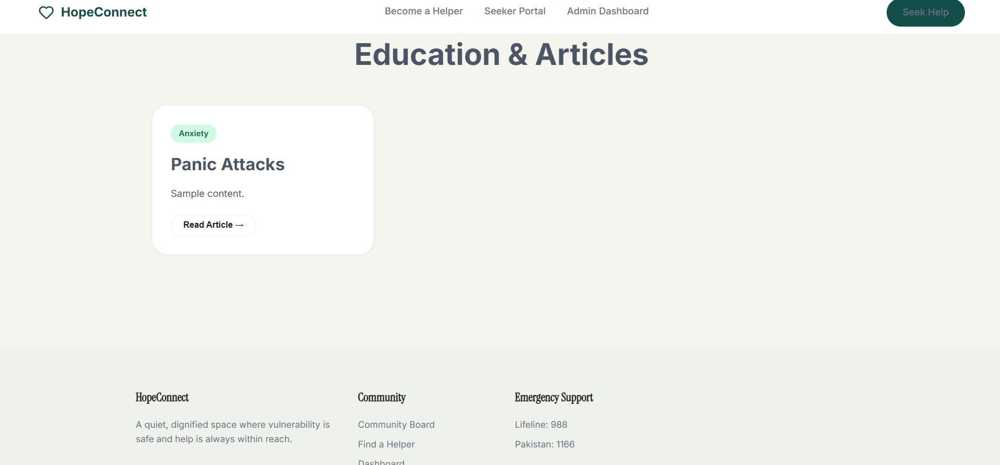
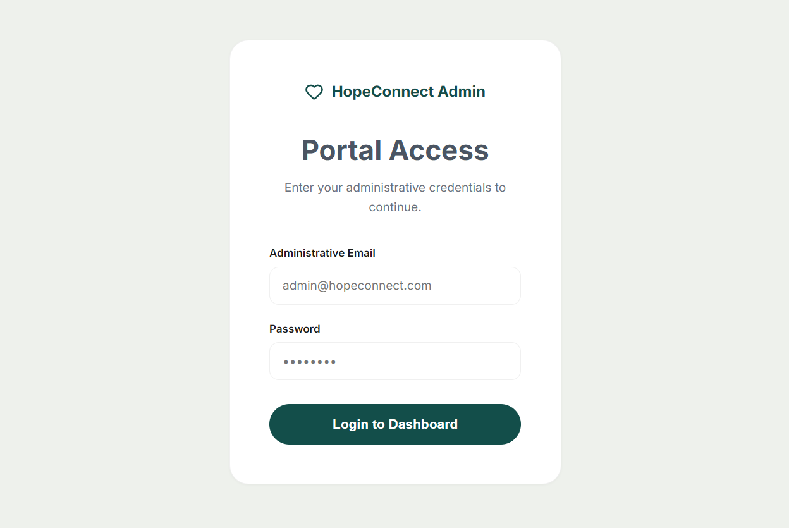

# HopeConnect: Peer Support & Crisis Intervention Platform

HopeConnect is a production-grade, AI-powered mental health platform designed to provide anonymous peer support and immediate crisis intervention resources. Built with a "DevOps-First" mindset, it features automated testing, containerization, and a robust CI/CD pipeline.

## 🚀 Features
- **AI Sentiment Engine**: Real-time monitoring of community posts to detect and escalate crisis situations.
- **Anonymous Peer Board**: A safe space for students to share stories and find solidarity.
- **Resource Hub**: Instant access to international and local (Pakistan) mental health helplines.
- **Helper Vetting System**: A professional portal for recruiting and approving peer counselors.

## 🛠 Tech Stack
- **Backend**: Flask (Python 3.11), SQLite
- **Frontend**: Vanilla HTML5, CSS3, JavaScript
- **DevOps**: Docker, GitHub Actions, Pytest, Gunicorn
- **Cloud**: AWS EC2 (Ubuntu 22.04)

## 📦 Quick Start (Docker)
```bash
docker build -t hotline-app:v1 .
docker run -d --restart=always -p 5000:5000 --name hopeconnect-app hotline-app:v1
```
Visit `http://localhost:5000` to see the app locally.

## 🌐 Live Demo
The application is currently live on AWS EC2:
**[http://13.234.226.40:5000](http://13.234.226.40:5000)**

## 📝 Documentation
For detailed deployment instructions, architecture diagrams, and testing evidence, please refer to the **[deployment_document.md](deployment_document.md)**.

---
*Developed as part of the DevOps Lab Project.*


---
---
## 🚀 Project Demo

### 🖼️ Web App Screenshots

<table>
  <tr>
    <td></td>
    <td></td>
    <td></td>
  </tr>
  <tr>
    <td></td>
    <td></td>
    <td></td>
  </tr>
  <tr>
    <td></td>
    <td></td>
    <td></td>
  </tr>
</table>
